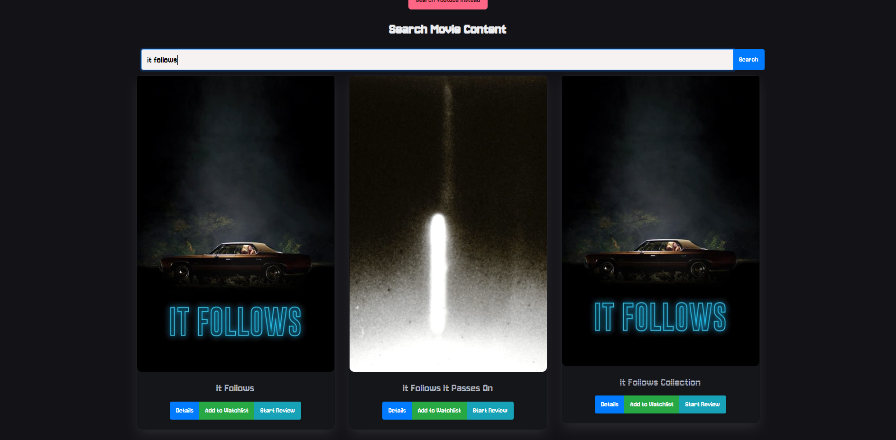

# Zrilla - Your Ultimate Thriller & Horror Movie Companion

## Link to application: 

Welcome to Zrilla, your go-to app for all things horror and thriller movies! Whether you're a seasoned horror aficionado or just dipping your toes into the genre's chilling waters, Zrilla has everything you need to keep track of your favorite films, rate them, and share your thoughts with fellow horror enthusiasts. With Zrilla, you can dive into the darkest corners of cinema and emerge unscathed... or maybe not.

## Usage

To use, all you have to do is navigate to this link: [zrilla.githup.com]
Check out our repository here: [zrilla.github-.]

The loaded webpage should look like this: 

## User Story

- **As a user** of the Zrilla Horror/Thriller app, I want to discover new horror and thriller movies, save and review my watched movies, and share my reviews with the community.

## Features

- **Polished UI** 

- **Fully Responsive** 

- **Movie Database:** Browse through a vast collection of horror and thriller movies. From classic cult favorites to the latest spine-tingling releases, Zrilla has it all.

- **Watchlist:** Keep track of the movies you want to watch and mark them for future viewing. Never miss out on a must-watch horror flick again!

- **Rating System:** Rate the movies you've watched based on various criteria such as story, acting, cinematography, and overall scariness. Share your ratings with friends and see how your opinions stack up against theirs.

- **Media Links:** Save links to streaming platforms, trailers, reviews, or any other relevant media related to the movies in your collection. Easily access additional content without leaving the app.

- **Trailers and Indie Horror:** Search for movie/tv trailers via integrated Youtube functionality and also view indie short horror media. 

## Coming Soon

- **Secure Data Storage:** Rest assured that your movie ratings, reviews, and watchlists are safely stored on our secure servers. Your privacy and data security are our top priorities.

- **Review & Discussion:** Share your thoughts and opinions on the movies you've watched. Discuss plot twists, analyze character development, and debate the merits of practical effects versus CGI with other users.

- **Recommendation Engine:** Receive personalized recommendations based on your movie preferences and viewing history. Discover hidden gems and new releases tailored to your taste.

- **Community Features:** Connect with other horror fans, join groups, and participate in themed events and challenges. Share your favorite horror memes, trivia, and fan theories with a vibrant community of like-minded individuals.

- **Enhanced User Profiles:** Customize your profile, showcase your favorite movies, and track your horror movie marathon progress. Earn badges and achievements as you unlock milestones and explore new genres.

- **Advanced Filtering & Sorting:** Find the perfect movie to match your mood with advanced filtering options based on genre, release year, director, and more. Sort your watchlist and collection to easily find what you're in the mood for.

Stay tuned for these exciting features and more as Zrilla continues to evolve and expand!

## Get Started

Ready to embark on a cinematic journey into the heart of darkness? Download Zrilla now and unleash your inner horror aficionado. Whether you're craving a psychological thriller, a supernatural scarefest, or a blood-soaked slasher flick, HorrorFlix has something to satisfy every craving. Let the screams begin!

## Credits

#### Collaborators: 
    Nick Zamboni []
    Chloe Hall []
    Tony Phelps []

#### This project could not have been done without our third-party collaborators: 

- **Server Side API's** 
    TMDB API:  []
    Youtube API: []
- **API's Used** 
    SortableJS: []
    JQuery: []
- **Frameworks Used** 
    Tailwind CSS: []
    Bootstrap CSS: []
    Bulma CSS: []
- **Client-Side Storage** 
    for persistent data

## License

Please refer to the MIT license in the repository. 

--